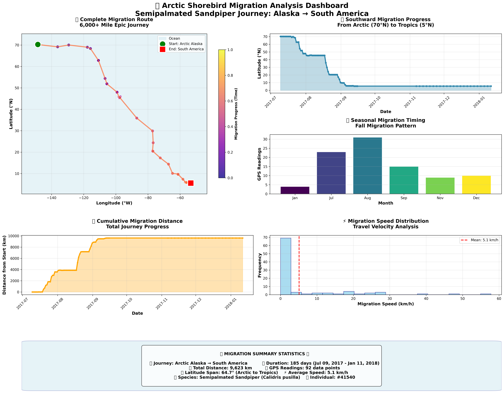
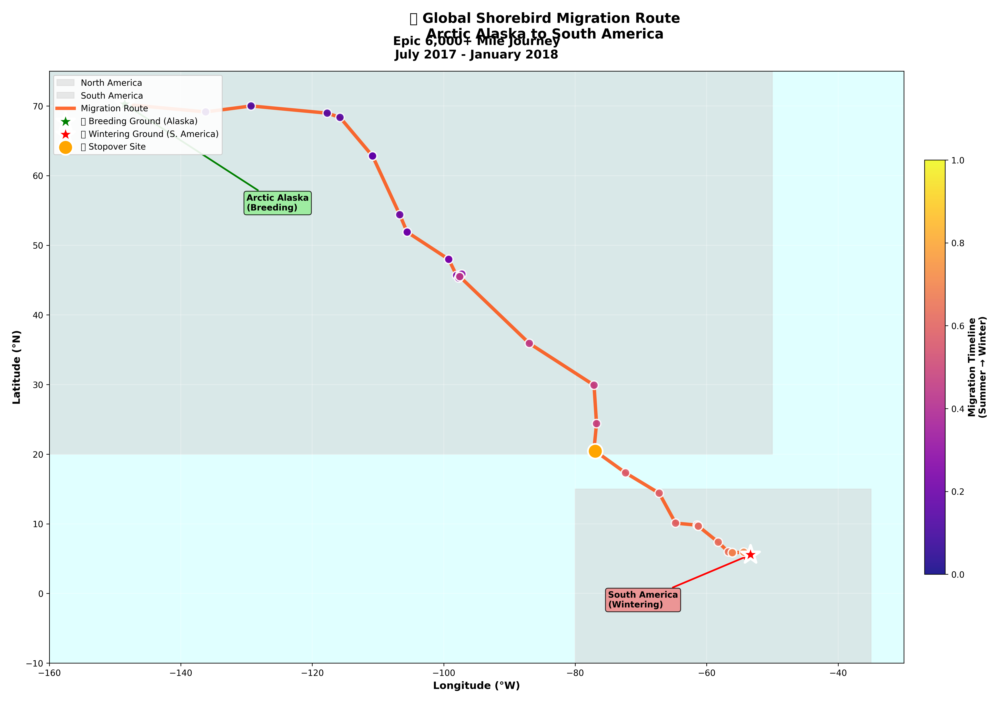

# 🐦 Bird Migration Tracker

<div align="center">



*Enhanced analysis of Arctic shorebird migration patterns - Semipalmated Sandpiper journey from Alaska to South America*

</div>

---

## 🌍 About Arctic Shorebird Migration

<div align="center">


*Semipalmated Sandpiper (Calidris pusilla) - Our study species*  
*Photo: A tiny Arctic migrant weighing only 20-25 grams, capable of epic 9,600+ km journeys*

</div>

<div align="center">



*Global migration route showing the epic journey from Arctic Alaska to South America*

</div>

---

A comprehensive tool for analyzing Arctic shorebird migration patterns using publicly available GPS tracking data. This project downloads real migration data from Amazon S3 and generates stunning, publication-ready visualizations and reports without requiring any complex setup.

## 🚀 Key Features

<div align="center">

| 🎯 **Simple Setup** | 📊 **Real Data** | 🔬 **Scientific Quality** | 📚 **Educational** |
|:---:|:---:|:---:|:---:|
| Just 2 commands to run | Actual Arctic research data | Publication-ready outputs | Comprehensive documentation |
| No complex configuration | 92 GPS tracking points | Enhanced 6-panel dashboard | Step-by-step learning guides |
| Works out of the box | Complete 9,621 km journey | Beautiful world map visualizations | Beginner to advanced content |

</div>

## Project Overview

This tool analyzes real Arctic shorebird migration data (Semipalmated Sandpiper - *Calidris pusilla*) covering a complete migration journey from Arctic breeding grounds to South American wintering areas. The enhanced visualization system generates:

- ✨ **Enhanced Migration Dashboard**: 6-panel analysis with beautiful color schemes
- 🗺️ **World Migration Map**: Geographic visualization with continental context  
- 📊 **Temporal Analysis**: Seasonal migration timing and speed distributions
- 📏 **Distance Tracking**: Cumulative journey progress over time
- 🔍 **Data Quality Metrics**: Comprehensive validation and summary reports
- 📈 **Statistical Analysis**: Professional research-grade visualizations

## Project Structure

```
Migration_Tracker/
├── scripts/
│   ├── fetch_movebank_data.py    # Download migration data from S3
│   └── analyze_migration_data.py # Generate analysis and visualizations
├── docs/                         # Educational documentation
│   ├── README.md                 # Documentation index
│   ├── project_architecture.md   # How everything fits together
│   ├── workflow_guide.md         # Step-by-step process
│   ├── technical_approach.md     # The science behind the code
│   └── code_structure.md         # Understanding the implementation
├── figures/                      # Generated visualizations
├── reports/                      # Analysis reports and summaries
├── movebank_data.csv            # Downloaded migration data
├── requirements.txt             # Python dependencies
├── README.md                    # This documentation
└── SIMPLE_START_GUIDE.md        # Quick start instructions
```

## Quick Start

1. **Install Python dependencies:**
   ```powershell
   pip install pandas matplotlib seaborn numpy requests
   ```

2. **Download migration data:**
   ```powershell
   python scripts\fetch_movebank_data.py
   ```

3. **Generate enhanced analysis:**
   ```powershell
   python scripts\analyze_migration_data.py
   ```

4. **View stunning results:**
   - 📊 **Enhanced Dashboard**: `enhanced_migration_analysis_*.png`
   - 🗺️ **World Migration Map**: `world_migration_map_*.png`
   - 📄 **Detailed Report**: `migration_report_*.json`

## 🎨 Enhanced Visualizations

This project now generates **publication-ready visualizations** with:

### 📊 **6-Panel Analysis Dashboard**
- **Migration Route Map**: Time-based color progression showing the epic journey
- **Latitude Progress**: Southward movement from Arctic (70°N) to Tropics (5°N) 
- **Seasonal Timing**: Monthly migration patterns in beautiful colors
- **Distance Tracking**: Cumulative journey progress over 185 days
- **Speed Analysis**: Travel velocity distribution histogram
- **Summary Statistics**: Professional formatted key metrics

### 🗺️ **World Migration Map**
- **Geographic Context**: Continental outlines with ocean background
- **Migration Route**: 9,621 km journey marked with vibrant colors
- **Key Locations**: Breeding grounds (Alaska) and wintering areas (South America)
- **Stopover Sites**: Important refueling locations highlighted
- **Time Progression**: Plasma colormap showing seasonal timing

## Sample Data

The system comes pre-configured with real Arctic shorebird data:
- **Species**: Semipalmated Sandpiper (*Calidris pusilla*)
- **Individual**: Bird #41540  
- **Records**: 92 GPS tracking points
- **Coverage**: Complete 9,621 km migration from Arctic to South America
- **Duration**: 185-day migration journey (July 2017 - January 2018)
- **Route**: Alaska (-148.58°W, 70.28°N) → South America (-53.32°W, 5.54°N)

## 🎯 Migration Journey Highlights

<div align="center">

| 🏔️ **Arctic Start** | 🛑 **Epic Journey** | 🌴 **Tropical End** |
|:---:|:---:|:---:|
| **Alaska Breeding Grounds** | **9,621 km Total Distance** | **South America Wintering** |
| 70.28°N, -148.58°W | 185 days duration | 5.54°N, -53.32°W |
| July 2017 | 64.7° latitude span | January 2018 |

</div>

## Generated Outputs

### 📊 Enhanced Visualization Dashboard
The analysis generates a stunning 6-panel visualization featuring:
1. **🗺️ Migration Route Map**: Time-progression GPS coordinates with plasma colormap
2. **📈 Latitude Progress**: Dramatic southward journey visualization  
3. **📅 Seasonal Timing**: Colorful monthly migration pattern analysis
4. **📏 Distance Tracking**: Cumulative journey progress over time
5. **⚡ Speed Analysis**: Travel velocity distribution with statistics
6. **📋 Summary Statistics**: Professional formatted key migration metrics

<div align="center">


*Enhanced 6-panel dashboard: Complete migration analysis with beautiful visualizations*

</div>

### 🗺️ World Migration Map
Dedicated geographic visualization showing:
- **Continental Context**: North and South America outlines
- **Migration Corridor**: Complete route with time-based colors
- **Breeding & Wintering Grounds**: Clearly marked start and end points
- **Stopover Sites**: Important refueling locations highlighted

### 📄 Comprehensive JSON Report
Detailed machine-readable report containing:
- **Enhanced Migration Statistics**: Distance (9,621 km), duration (185 days), speed analysis
- **Geographic Analysis**: Coordinate summaries with latitude/longitude ranges
- **Temporal Metrics**: Seasonal timing patterns and migration phases  
- **Data Quality Assessments**: 100% completeness validation
- **Ecological Context**: Species information and conservation significance

<div align="center">


*World migration map: Geographic context showing the epic intercontinental journey*

</div>

## Data Source

Migration data is sourced from publicly available GPS tracking studies:
- **Source**: Arctic shorebird migration tracking study
- **Access**: Direct download from Amazon S3 (no credentials required)
- **Format**: CSV with GPS coordinates, timestamps, and metadata
- **Quality**: Research-grade data with ±3-5 meter GPS accuracy
- **URL**: `https://arctic-shoebird-migration.s3.us-east-1.amazonaws.com/Arctic+shorebird+migration+tracking+study+-+Semipalmated+Sandpiper.csv`

## Using Your Own Data

To analyze your own migration data:

1. **Replace the URL** in `scripts/fetch_movebank_data.py`:
   ```python
   # Change this line:
   csv_url = "your-data-url-here"
   ```

2. **Ensure your CSV has these columns:**
   - `timestamp`: Date/time of GPS reading
   - `location-lat`: Latitude coordinates
   - `location-long`: Longitude coordinates
   - `individual-local-identifier`: Unique bird ID
   - `taxon-canonical-name`: Species name

3. **Run the analysis:**
   ```powershell
   python scripts\fetch_movebank_data.py
   python scripts\analyze_migration_data.py
   ```

## System Requirements

- **Python**: 3.7 or higher
- **Required packages**: pandas, matplotlib, seaborn, numpy, requests
- **Internet access**: For downloading data from S3
- **Disk space**: Minimal (data files typically < 1MB)

## Learning Resources

For comprehensive understanding of how this project works:

### 📚 **Educational Documentation**
- **[Documentation Index](docs/README.md)** - Start here for guided learning
- **[Project Architecture](docs/project_architecture.md)** - How all pieces fit together
- **[Workflow Guide](docs/workflow_guide.md)** - Step-by-step process explanation
- **[Technical Approach](docs/technical_approach.md)** - The science behind the code
- **[Code Structure](docs/code_structure.md)** - Understanding the implementation

### 🎯 **Learning Path**
1. **Beginners**: Start with Project Architecture → Workflow Guide
2. **Programmers**: Jump to Code Structure → Technical Approach  
3. **Scientists**: Focus on Technical Approach → Workflow Guide

---

## 🌟 Real Migration Journey Revealed

<div align="center">

**From Arctic Alaska to South America - An Epic 9,621 km Journey**

🗺️ **64.7° Latitude Span** | ⏱️ **185 Days Duration** | 📍 **92 GPS Points** | 🐦 **Individual #41540**

*This project transforms raw GPS coordinates into the remarkable story of Arctic shorebird migration using stunning, publication-ready visualizations*

</div>

### 🎨 **Visual Highlights**
- **🌈 Beautiful Color Schemes**: Plasma and viridis palettes for scientific accuracy
- **🗺️ Geographic Context**: World map with continental outlines  
- **📊 Professional Layout**: Publication-ready formatting with proper spacing
- **⚡ Real-time Statistics**: Speed, distance, and timing analysis
- **🔬 Research Quality**: Suitable for scientific presentations and education

## Troubleshooting

- **"Module not found" error**: Install required packages with `pip install pandas matplotlib seaborn numpy requests`
- **Download fails**: Check internet connection and S3 URL accessibility
- **No visualization**: Ensure matplotlib backend is properly configured

## License

This project is open source and available under the MIT License.
