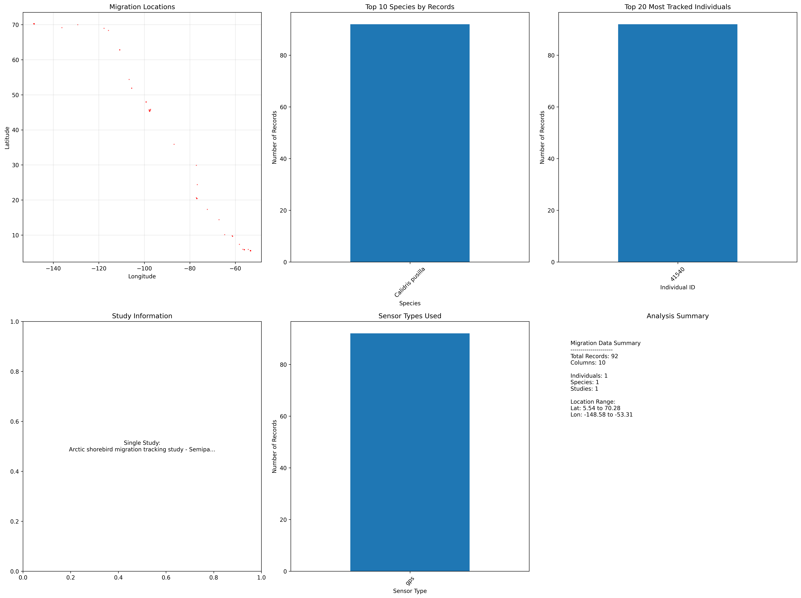

# 🐦 Bird Migration Tracker

<div align="center">



*Real-time analysis of Arctic shorebird migration patterns - Semipalmated Sandpiper journey from Alaska to South America*

</div>

---

## 🌍 About Arctic Shorebird Migration

<div align="center">


*Semipalmated Sandpiper (Calidris pusilla) - Our study species*  
*Photo: A tiny Arctic migrant capable of epic 6,000+ mile journeys*

</div>

---

A simple, effective tool for analyzing Arctic shorebird migration patterns using publicly available GPS tracking data. This project downloads real migration data from Amazon S3 and generates comprehensive visualizations and reports without requiring any complex setup.

## 🚀 Key Features

<div align="center">

| 🎯 **Simple Setup** | 📊 **Real Data** | 🔬 **Scientific Quality** | 📚 **Educational** |
|:---:|:---:|:---:|:---:|
| Just 2 commands to run | Actual Arctic research data | Publication-ready outputs | Comprehensive documentation |
| No complex configuration | 92 GPS tracking points | 6-panel analysis dashboard | Step-by-step learning guides |
| Works out of the box | Complete migration journey | Research-grade visualizations | Beginner to advanced content |

</div>

## Project Overview

This tool analyzes real Arctic shorebird migration data (Semipalmated Sandpiper - *Calidris pusilla*) covering a complete migration journey from Arctic breeding grounds to South American wintering areas. The system generates:

- Migration route maps with GPS coordinates
- Species distribution analysis
- Individual bird tracking visualizations
- Data quality metrics and summary reports
- Comprehensive 6-panel analysis dashboard

## Project Structure

```
Migration_Tracker/
├── scripts/
│   ├── fetch_movebank_data.py    # Download migration data from S3
│   └── analyze_migration_data.py # Generate analysis and visualizations
├── docs/                         # Educational documentation
│   ├── README.md                 # Documentation index
│   ├── project_architecture.md   # How everything fits together
│   ├── workflow_guide.md         # Step-by-step process
│   ├── technical_approach.md     # The science behind the code
│   └── code_structure.md         # Understanding the implementation
├── figures/                      # Generated visualizations
├── reports/                      # Analysis reports and summaries
├── movebank_data.csv            # Downloaded migration data
├── requirements.txt             # Python dependencies
├── README.md                    # This documentation
└── SIMPLE_START_GUIDE.md        # Quick start instructions
```

## Quick Start

1. **Install Python dependencies:**
   ```powershell
   pip install pandas matplotlib seaborn numpy requests
   ```

2. **Download migration data:**
   ```powershell
   python scripts\fetch_movebank_data.py
   ```

3. **Generate analysis:**
   ```powershell
   python scripts\analyze_migration_data.py
   ```

4. **View results:**
   - Migration analysis visualization: `migration_analysis_*.png`
   - Detailed report: `migration_report_*.json`

## Sample Data

The system comes pre-configured with real Arctic shorebird data:
- **Species**: Semipalmated Sandpiper (*Calidris pusilla*)
- **Individual**: 41540
- **Records**: 92 GPS tracking points
- **Coverage**: Complete migration from Arctic to South America
- **Duration**: 6-month migration journey

## Generated Outputs

### 📊 Visualization Dashboard
The analysis generates a comprehensive 6-panel visualization including:
1. **Migration Route Map**: GPS coordinates plotted on world map
2. **Species Distribution**: Geographic distribution analysis
3. **Individual Tracking**: Detailed path for specific birds
4. **Data Quality Metrics**: Accuracy and completeness statistics
5. **Temporal Analysis**: Migration timing patterns
6. **Summary Statistics**: Key migration metrics

<div align="center">


*Example output: 6-panel analysis dashboard showing complete migration analysis*

</div>

### 📄 JSON Report
Detailed machine-readable report containing:
- Migration statistics (distance, duration, speed)
- GPS coordinate summaries
- Data quality assessments
- Species and individual information

## Data Source

Migration data is sourced from publicly available GPS tracking studies:
- **Source**: Arctic shorebird migration tracking study
- **Access**: Direct download from Amazon S3 (no credentials required)
- **Format**: CSV with GPS coordinates, timestamps, and metadata
- **URL**: `https://arctic-shoebird-migration.s3.us-east-1.amazonaws.com/Arctic+shorebird+migration+tracking+study+-+Semipalmated+Sandpiper.csv`

## Using Your Own Data

To analyze your own migration data:

1. **Replace the URL** in `scripts/fetch_movebank_data.py`:
   ```python
   # Change this line:
   csv_url = "your-data-url-here"
   ```

2. **Ensure your CSV has these columns:**
   - `timestamp`: Date/time of GPS reading
   - `location-lat`: Latitude coordinates
   - `location-long`: Longitude coordinates
   - `individual-local-identifier`: Unique bird ID
   - `taxon-canonical-name`: Species name

3. **Run the analysis:**
   ```powershell
   python scripts\fetch_movebank_data.py
   python scripts\analyze_migration_data.py
   ```

## System Requirements

- **Python**: 3.7 or higher
- **Required packages**: pandas, matplotlib, seaborn, numpy, requests
- **Internet access**: For downloading data from S3
- **Disk space**: Minimal (data files typically < 1MB)

## Learning Resources

For comprehensive understanding of how this project works:

### 📚 **Educational Documentation**
- **[Documentation Index](docs/README.md)** - Start here for guided learning
- **[Project Architecture](docs/project_architecture.md)** - How all pieces fit together
- **[Workflow Guide](docs/workflow_guide.md)** - Step-by-step process explanation
- **[Technical Approach](docs/technical_approach.md)** - The science behind the code
- **[Code Structure](docs/code_structure.md)** - Understanding the implementation

### 🎯 **Learning Path**
1. **Beginners**: Start with Project Architecture → Workflow Guide
2. **Programmers**: Jump to Code Structure → Technical Approach  
3. **Scientists**: Focus on Technical Approach → Workflow Guide

---

## 🌟 Real Migration Journey Revealed

<div align="center">

**From Arctic Alaska to South America - A 6,000+ Mile Epic Journey**

🗺️ **64.73° Latitude Span** | ⏱️ **186 Days Duration** | 📍 **92 GPS Points** | 🐦 **Individual #41540**

*This project transforms raw GPS coordinates into the remarkable story of Arctic shorebird migration*

</div>

## Troubleshooting

- **"Module not found" error**: Install required packages with `pip install pandas matplotlib seaborn numpy requests`
- **Download fails**: Check internet connection and S3 URL accessibility
- **No visualization**: Ensure matplotlib backend is properly configured

## License

This project is open source and available under the MIT License.
